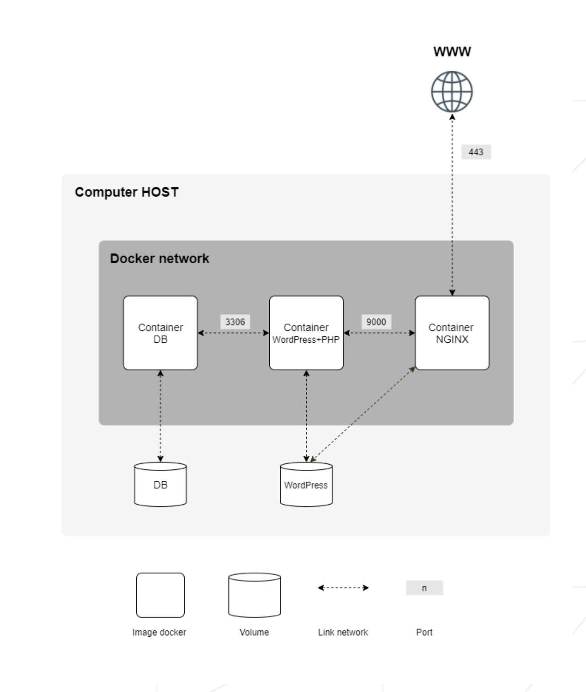

# Inception

## Summary
This document is a System Administration related exercise. The project involves setting up a small infrastructure using Docker, aimed at broadening your knowledge of system administration.

## Contents
1. [Preamble](#preamble)
2. [Introduction](#introduction)
3. [General Guidelines](#general-guidelines)
4. [Mandatory Part](#mandatory-part)

---

## Chapter I
### Preamble
This project aims to broaden your knowledge of system administration by using Docker. You will virtualize several Docker images, creating them in your new personal virtual machine.

---

## Chapter II
### Introduction
The goal of this project is to set up a small infrastructure using Docker. This involves creating and configuring Docker images in a virtual machine, utilizing Docker Compose to manage the setup.

---

## Chapter III
### General Guidelines
- This project must be completed on a Virtual Machine.
- All files required for the configuration of your project must be placed in a `srcs` folder.
- A `Makefile` is required and must be located at the root of your directory. It must set up your entire application (i.e., build the Docker images using `docker-compose.yml`).
- Read a lot of documentation related to Docker usage, as this subject might include concepts you are not familiar with yet.

---

## Chapter IV
### Mandatory Part
This project consists of setting up a small infrastructure composed of different services under specific rules. The entire project must be done in a virtual machine using Docker Compose.

#### Requirements:
- Each Docker image must have the same name as its corresponding service.
- Each service must run in a dedicated container.
- Containers must be built from the penultimate stable version of Alpine or Debian.
- You must write your own Dockerfiles, one per service.
- The Dockerfiles must be called in your `docker-compose.yml` by your Makefile.
- You must build the Docker images yourself; pulling ready-made Docker images or using services such as DockerHub is forbidden (except for Alpine/Debian).

#### Services to set up:
1. A Docker container with NGINX configured with TLSv1.2 or TLSv1.3 only.
2. A Docker container with WordPress + php-fpm installed and configured (without nginx).
3. A Docker container with MariaDB (without nginx).
4. A volume for your WordPress database.
5. A second volume for your WordPress website files.
6. A docker-network to establish the connection between your containers.

#### Additional Guidelines:
- Containers must restart in case of a crash.
- Avoid using 'tail -f' and similar methods to run containers.
- Network configuration must be specified in your `docker-compose.yml` file without using `network: host`, `--link`, or `links:`.
- Avoid using infinite loops in commands, entrypoints, or entrypoint scripts (e.g., `tail -f`, `bash`, `sleep infinity`, `while true`).
- In your WordPress database, there must be two users, with one being an administrator. The administrator's username cannot contain 'admin', 'Admin', or 'administrator'.
- Volumes must be available in the `/home/login/data` folder of the host machine using Docker.
- Configure your domain name to point to your local IP address, formatted as `login.42.fr`.
- The latest tag is prohibited.
- No passwords should be present in your Dockerfiles; use environment variables instead.
- Use a `.env` file to store environment variables, located at the root of the `srcs` directory.
- The NGINX container must be the only entrypoint into your infrastructure via port 443, using TLSv1.2 or TLSv1.3.

#### Example Diagram:


#### Example Directory Structure:
```sh
$> ls -alR
total XX
drwxrwxr-x 3 login login 4096 month day time .
drwxrwxrwt 17 login login 4096 month day time ..
-rw-rw-r-- 1 login login XXXX month day time Makefile
drwxrwxr-x 3 login login 4096 month day time srcs
./srcs:
total XX
drwxrwxr-x 3 login login 4096 month day time .
drwxrwxr-x 3 login login 4096 month day time ..
-rw-rw-r-- 1 login login XXXX month day time docker-compose.yml
-rw-rw-r-- 1 login login XXXX month day time .env
drwxrwxr-x 5 login login 4096 month day time requirements
./srcs/requirements:
total XX
drwxrwxr-x 5 login login 4096 month day time .
drwxrwxr-x 3 login login 4096 month day time ..
drwxrwxr-x 4 login login 4096 month day time bonus
drwxrwxr-x 4 login login 4096 month day time mariadb
drwxrwxr-x 4 login login 4096 month day time nginx
drwxrwxr-x 4 login login 4096 month day time tools
drwxrwxr-x 4 login login 4096 month day time wordpress
./srcs/requirements/mariadb:
total XX
drwxrwxr-x 4 login login 4096 month day time .
drwxrwxr-x 5 login login 4096 month day time ..
drwxrwxr-x 2 login login 4096 month day time conf
-rw-rw-r-- 1 login login XXXX month day time Dockerfile
-rw-rw-r-- 1 login login XXXX month day time .dockerignore
drwxrwxr-x 2 login login 4096 month day time tools
[...]
./srcs/requirements/nginx:
total XX
drwxrwxr-x 4 login login 4096 month day time .
drwxrwxr-x 5 login login 4096 month day time ..
drwxrwxr-x 2 login login 4096 month day time conf
-rw-rw-r-- 1 login login XXXX month day time Dockerfile
-rw-rw-r-- 1 login login XXXX month day time .dockerignore
drwxrwxr-x 2 login login 4096 month day time tools
[...]
$> cat srcs/.env
DOMAIN_NAME=login.42.fr
# certificates
CERTS_=./XXXXXXXXXXXX
# MYSQL SETUP
MYSQL_ROOT_PASSWORD=XXXXXXXXXXXX
MYSQL_USER=XXXXXXXXXXXX
MYSQL_PASSWORD=XXXXXXXXXXXX
[...]
